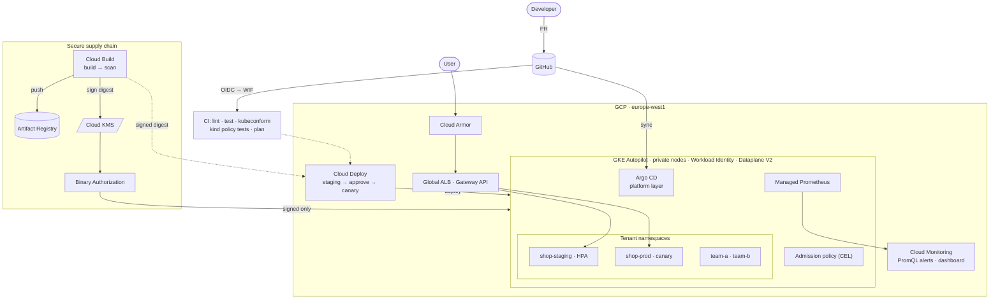

# GKE Platform Engineering on Google Cloud

An **internal developer platform** on GKE Autopilot: secure-by-default multi-tenancy, a signed-image-only supply chain, GitOps for the platform layer, progressive delivery with automatic canary and one-command rollback, a WAF-protected Gateway, and golden-signal observability — all provisioned and destroyed by **one script each**.

> **Status: built and statically verified; first live deployment pending.**
> Verified so far: `terraform plan` = 97 resources against the target project (0 destroy); all Kubernetes manifests schema-valid; the admission policies pass 9/9 deny/allow cases **on a real Kubernetes API server** and the suite provably fails when a policy is removed; app unit tests pass. The live proof (`scripts/test.sh`, 26 checks across 9 areas) runs at the end of `./scripts/up.sh` and writes [`docs/test-results.md`](docs/test-results.md). Runbook outputs are marked *Captured* vs *Expected* accordingly.

```bash
gcloud config set project <your-project>      # billing linked; the rest is auto-detected
./scripts/up.sh       # infra → cluster → GitOps → signed build → staging → prod canary → live tests
./scripts/down.sh     # delete everything (--purge also drops the state bucket)
```

## Why this is a platform, not a cluster

| Concern | Mechanism | Proven by |
|---|---|---|
| **Only trusted code runs** | Cloud Build builds, scans and signs each image *digest* with a KMS-held key; **Binary Authorization** admits only signed digests; tags immutable | live test §2 (unsigned Docker Hub image denied, our build admitted) |
| **Org rules as code** | Native **ValidatingAdmissionPolicy** (CEL, in the API server): no `:latest`, team label required, no `LoadBalancer` Services | 9-case suite on a real API server, in CI |
| **Multi-tenancy** | Namespace per team: Pod Security `restricted`, quota, default-deny NetworkPolicy, per-tenant identity | live tests §4–§5 |
| **Keyless cloud access** | Workload Identity Federation for GKE: IAM granted straight to `ns/<ns>/sa/<sa>`; no service-account keys anywhere | team-a reads its bucket, team-b gets 403 |
| **Safe releases** | **Cloud Deploy**: staging → manual approval → 25 % → 50 % → 100 % canary; alert-guarded; one-command rollback | `scripts/demo-bad-release.sh` |
| **Edge protection** | Global external ALB via **Gateway API** + **Cloud Armor** (OWASP SQLi/XSS, rate limit) | live test §6 |
| **GitOps for the platform** | **Argo CD** app-of-apps, self-heal + prune, scoped `AppProject` | drift heal in runbook 03 |
| **Observability** | Managed Prometheus → Cloud Monitoring PromQL alerts, dashboard, uptime check, SLO signal | live test §8 |
| **FinOps** | GKE usage metering → BigQuery; `team` label enforced; budget alerts; quotas | runbook 08 |
| **Keyless CI/CD** | GitHub OIDC → WIF; separate read-only plan vs gated deploy identities | ADR / CI |

## Architecture


Every pod passes **three independent admission gates**: Pod Security (how it runs) → ValidatingAdmissionPolicy (org rules) → Binary Authorization (what it is). Details: [architecture](docs/architecture.md).

## Design decisions

| ADR | Decision | Trade-off called out |
|---|---|---|
| [0001](docs/adr/0001-autopilot-over-standard.md) | Autopilot over Standard | No custom nodes/GPUs; escape hatch documented |
| [0002](docs/adr/0002-argocd-for-platform-cloud-deploy-for-apps.md) | Argo CD for platform, Cloud Deploy for apps | Two tools, hard ownership boundary |
| [0003](docs/adr/0003-control-plane-access.md) | Authorized networks + Google IPs, not a private endpoint | Wider API exposure; private-pool path documented |
| [0004](docs/adr/0004-binary-authorization-kms-attestation.md) | KMS-signed attestations, digest-pinned releases | Allow-list for upstream add-ons is a reviewed hole |
| [0005](docs/adr/0005-canary-and-hpa.md) | Pod-count canary; HPA only in staging | Approximate traffic split |
| [0006](docs/adr/0006-validating-admission-policy-over-gatekeeper.md) | Native CEL policies, not Gatekeeper/Kyverno | No mutation/generation |
| [0007](docs/adr/0007-gateway-api-and-cloud-armor.md) | Shared Gateway + WAF | HTTP only in the demo (no domain) |
| [0008](docs/adr/0008-tenancy-model.md) | Namespace tenancy + per-tenant WI principal | Soft multi-tenancy |

[Threat model](docs/threat-model.md) maps every STRIDE threat to a control **and the test that proves it**.

## Runbooks

[docs/runbooks](docs/runbooks/README.md): build & teardown · access · GitOps changes · supply chain · release/canary/rollback · tenancy & policy · incident response · cost · troubleshooting (including bugs caught before the first deployment).

## Repository layout

```
terraform/     root + modules: network, gke, binauthz, delivery, edge, observability, github_wif
gitops/        Argo CD bootstrap + platform layer (namespaces, netpol, policies, gateway, monitoring)
k8s/ skaffold  application manifests (Kustomize base + staging/prod overlays) delivered by Cloud Deploy
app/           "shop" service: probes, RED metrics, graceful shutdown, fault-injection switch
tests/         admission-policy behavioural suite (runs on kind in CI and on GKE)
scripts/       up.sh · down.sh · test.sh · demo-bad-release.sh
cloudbuild.yaml  build → scan → sign
```

## Cost & safety

Autopilot bills per pod request; everything is created for a session and destroyed by `down.sh`. A demo left running for a day costs a few euros (Autopilot pods, Cloud NAT, load balancer, Cloud Armor). A budget with alerts is created by Terraform. `down.sh` removes the load balancer and NEGs that the Gateway controller creates *outside* Terraform before destroying the VPC, so teardown doesn't hang.

## Known gaps (deliberate)

Public API endpoint with allow-list (not private + private pools) · HTTP only (no domain for a managed cert) · Binary Authorization requires a signature but not yet a provenance/vulnerability attestation · soft multi-tenancy · no service mesh. See the [threat model](docs/threat-model.md).

## License

MIT
