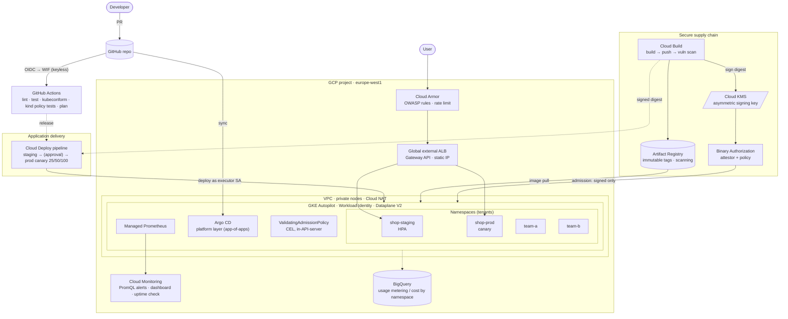

# Architecture

## Layers and owners

| Layer | Owner | Where |
|---|---|---|
| Cloud foundation (VPC, NAT, IAM, KMS, registry, WAF, budgets, alerts) | Terraform | `terraform/` |
| Cluster (Autopilot, private nodes, WI, Gateway API, Binary Authz, GMP) | Terraform | `terraform/modules/gke` |
| Cluster platform (namespaces, quota, netpol, policies, gateway, monitoring) | Argo CD | `gitops/` |
| Application releases | Cloud Deploy | `k8s/`, `skaffold.yaml` |
| Image build, scan, sign | Cloud Build | `cloudbuild.yaml` |
| Proof | scripts | `scripts/test.sh`, `tests/` |

## Request path
`Client → Cloud Armor (WAF/throttle) → Global ALB (Gateway API) → NEG → pod` (container-native, pod IPs as backends; no node hop).

## Release path
`git push → CI → Cloud Build (build · scan · sign) → Cloud Deploy release (digest-pinned) → staging (auto) → prod (approval → 25 % → 50 % → 100 %) → alert-driven rollback`.

## Admission path (three independent gates on every pod)
1. **Pod Security `restricted`** — how it runs.
2. **ValidatingAdmissionPolicy** — org rules (no `:latest`, team label, no public Services).
3. **Binary Authorization** — what it is (signed by our pipeline).
